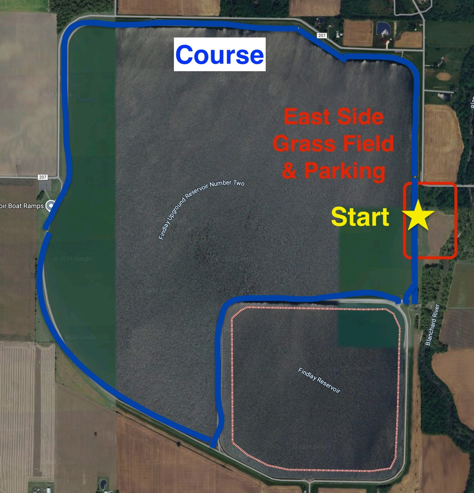

# Flag City Backyard Ultra — Runners Guide
*Last updated: 2025-09-20*

## Quick Facts

* **Format**: Backyard Ultra, Last Person Standing
* **Lap**: 4.3 miles each hour
* **BIB Pickup**: (Runners MUST pickup their BIB before 7:30 AM morning of the race.)
  * Friday, October 3, 2025 at 7:00 PM - 9:00 PM 
  * Saturday, October 4, 2025 at 6:30 AM - 7:30 AM
* **Race Start**: 
  * Saturday, October 4, 2025 at 8:00 AM ET
* **Registration**:
  * Closed Midnight October 2, 2025
  * Limit 160 Runners
* **Location**: Findlay Reservoir (East Side), Findlay, Ohio
* **Entry fee**: Free
* **Support**: Self-supported. No food, drink, or supplies provided by the race
* **Swag**: The frist 100 registered runners will receive a free shirt

## Where

* **Location**: Findlay Reservoir (East Side)
* **Maps**: [Google Maps Link](https://maps.app.goo.gl/pnXnPsiV9546S51b9)
* **Lat/Long**: 41.021, -83.559
* 

## Parking, Drop‑off, Camping, Facilities

Runners and crew have the option to setup their tent the night before and spend the night on the reservoir. Note: There is no running water available but there will be toilets.

* **Parking**: In the grass at the base of the reservoir.
* **Drop‑off**: Vehicles may drive to the top to unload only, then return to base parking.
* **Camping**: Tents are allowed to be set up the night before. Camping overnight is allowed.
* **Toilets**: Porta‑johns onsite.
* **Water**: No running water available on site
* 

## Course

* **Distance**: 4.3 miles per loop
* **Surface**: Fine Gravel. Flat.
* **Elevation**: Approximately 0 ft gain per loop
* 
* **Direction**: At the start of each lap, a coin is flipped to determine which direction that lap is run.

## Schedule

* **Friday, Oct 3rd**
  * **Noon**: Runners / Crew can setup tents
  * **6 PM - 9 PM**: Early registration. 
* **Saturday, Oct 4th**
  * **6:30 AM - 7:30 AM**: Registration.
  * **7:45 AM**: Rules Review Talk
  * **8:00 AM** First Loop Starts
* **Top of every hour** Next Loop Starts
* **End**: The race will continue until only one runner remains

## Rules

* Runners must be **in the starting corral** at the start whistle
* Each loop **starts at the top of the hour**
* **No late starts**
* **No leaving the course** during a loop except for the restroom
* **No aid** during a loop
* Each loop must be completed **within one hour** to count (including the final loop)
* **No artificial aids** including trekking poles
* Slower runners must allow passes
* **Winner** is the last person to complete a loop; all others are DNF. If no one can complete one more loop than the rest, there is **no winner**

## Aid & Gear

* **Provided by race**: none
* **Bring**: all food, drink, lighting, and gear you expect to need
* **Headlamp**: required for night running

## Weather

* **Rain or shine** Prepare for wide temperature swings day to night

## Registration

* **Platform**: [UltraSignup](https://ultrasignup.com/entrants_event.aspx?did=120210)
* **Closes**: Thursday, October 2, 11:59 PM ET
* **Cost**: \$0

## Communication & Links

* **Facebook Group**: [https://www.facebook.com/groups/727850778512939](https://www.facebook.com/groups/727850778512939)
* **UltraSignup Entrants/Info**: [https://ultrasignup.com/entrants\_event.aspx?did=120210](https://ultrasignup.com/entrants_event.aspx?did=120210)
* **UltraSignup Registration**: [https://ultrasignup.com/register.aspx?did=120210](https://ultrasignup.com/register.aspx?did=120210)
* **Big’s Backyard Listing**: [https://bigsbackyardultra.com/races/flag-city-backyard-ultra/](https://bigsbackyardultra.com/races/flag-city-backyard-ultra/)

## Crew & Spectators

* Crew may stage in designated camp area near the corral
* Vehicle access to the top is **drop‑off only**; no vehicle parking on the dike
* Keep paths clear for runners between loops
* Keep bathrooms available for runners at the end of each hour

## Leader Board

A leader board will be present to track successfully completed laps.

* Each runner will have a row using thier BIB number.
* As runners complete a lap, the runner or their crew will update the board with an 'X' when they complete a lap.
* If a runner fails to complete a lap in time or drops from the race, the lap they fail to complete is marked "DNF". 
* Runners or Crew 

## Safety & Conduct

* Follow instructions from race staff and volunteers
* Be courteous when passing
* Pack out trash and keep staging areas tidy
* If you drop, notify timing before leaving

## Medical

* Self-managed first aid; call 911 for emergencies
* Provide emergency contact info on your bib or person

