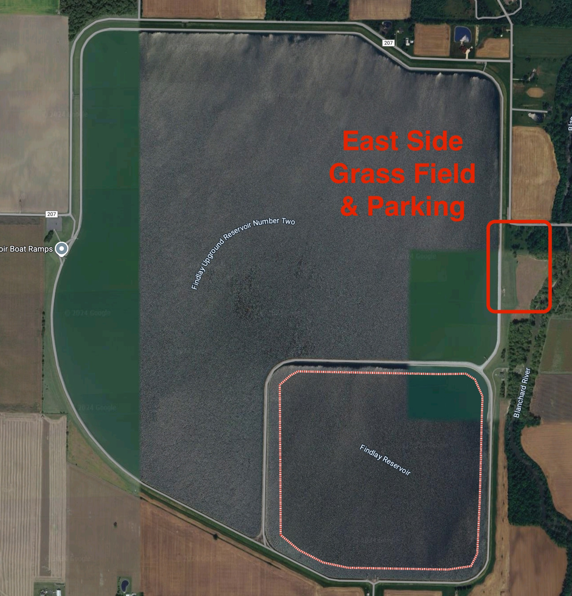

# Flag City Backyard Ultra — Guide
*Last updated: 2025-09-20*

## Quick Facts

* **Format**: Backyard Ultra, last-person-standing
* **Lap**: 4.3 miles each hour
* **Start**: Saturday, October 4, 2025 at 8:00 AM ET
* **Location**: Findlay Reservoir (East Side), Findlay, Ohio
* **Entry fee**: Free
* **Support**: Self-supported. No food, drink, or supplies provided by the race
* **Swag**: The frist 100 registered runners will receive a free shirt

## Where

* **Venue**: Findlay Reservoir (East Side)
* **Maps**: [Google Maps Link](https://maps.app.goo.gl/pnXnPsiV9546S51b9)
* **Lat/Long**: 41.021, -83.559
* 

## Parking, Drop‑off, Camping, Facilities

* **Parking**: In the grass at the base of the reservoir
* **Drop‑off**: Vehicles may drive to the top to unload only, then return to base parking
* **Camping**: Tents are allowed to be set up the night before. Camping overnight is allowed
* **Toilets**: Porta‑johns onsite
* **Water**: No running water available on site

## Course

* **Distance**: 4.3 miles per loop
* **Surface**: Upground reservoir loop. Flat. No roots, no mud
* **Elevation**: Approximately 0 ft gain per loop

## Schedule

* **07:57** whistle sequence at 3, 2, 1 minutes
* **08:00** first loop starts
* **Top of every hour** next loop starts
* Repeats until only one runner remains

## Rules (Backyard Standard as implemented at FCBU)

* Runners must be **in the starting corral** at the start whistle
* Each loop **starts at the top of the hour**
* **No late starts**
* **No leaving the course** during a loop except for restrooms
* **No personal aid** during a loop; common aid area between loops is allowed
* Each loop must be completed **within one hour** to count (including the final loop)
* **No artificial aids** including trekking poles
* Slower runners must allow passes
* **Winner** is the last person to complete a loop; all others are DNF. If no one can complete one more loop than the rest, there is **no winner**

## Aid & Gear

* **Provided by race**: none
* **Bring**: all food, drink, lighting, and gear you expect to need
* **Headlamp**: required for night running
* **Drop bags**: set up at your camp space near the corral

## Weather

* **Rain or shine** event in early October. Prepare for wide temperature swings day to night

## Registration

* **Platform**: UltraSignup
* **Closes**: Thursday, October 2, 11:59 PM ET
* **Cost**: \$0

## Communication & Links

* **Facebook Group**: [https://www.facebook.com/groups/727850778512939](https://www.facebook.com/groups/727850778512939)
* **UltraSignup Entrants/Info**: [https://ultrasignup.com/entrants\_event.aspx?did=120210](https://ultrasignup.com/entrants_event.aspx?did=120210)
* **UltraSignup Registration**: [https://ultrasignup.com/register.aspx?did=120210](https://ultrasignup.com/register.aspx?did=120210)
* **Big’s Backyard Listing**: [https://bigsbackyardultra.com/races/flag-city-backyard-ultra/](https://bigsbackyardultra.com/races/flag-city-backyard-ultra/)

## Past Editions

* **2024**: Winner **Quinn D. Auten** with **19 laps** (≈ 81.7 miles). Third annual event. 46 starters. Assist: **Austin Brougher** with 18 laps
* **2022**: Event held Saturday, September 3, 2022, 8:00 AM start

## Crew & Spectators

* Crew may stage in designated camp area near the corral
* Vehicle access to the top is **drop‑off only**; no vehicle parking on the dike
* Keep paths clear for runners between loops

## Safety & Conduct

* Follow instructions from race staff and volunteers
* Be courteous when passing
* Pack out trash and keep staging areas tidy
* If you drop, notify timing before leaving

## Medical

* Self-managed first aid; call 911 for emergencies
* Provide emergency contact info on your bib or person

## Open Items / To Confirm

* Exact corral layout and camp layout map
* Onsite signage locations and start/finish arch placement
* Generator use policy and quiet hours (if any)
* Pacers policy between loops (on-course pacers not allowed during loops per backyard rules)
* Post-race awards or recognition plan
* Volunteer call and roles schedule

---

### Organizer Notes (internal)

* Keep UltraSignup page updated with any changes to parking, camping, or rules
* Pin this doc link in the Facebook group and include in pre-race email
* Upload any course image or simple loop diagram when available
